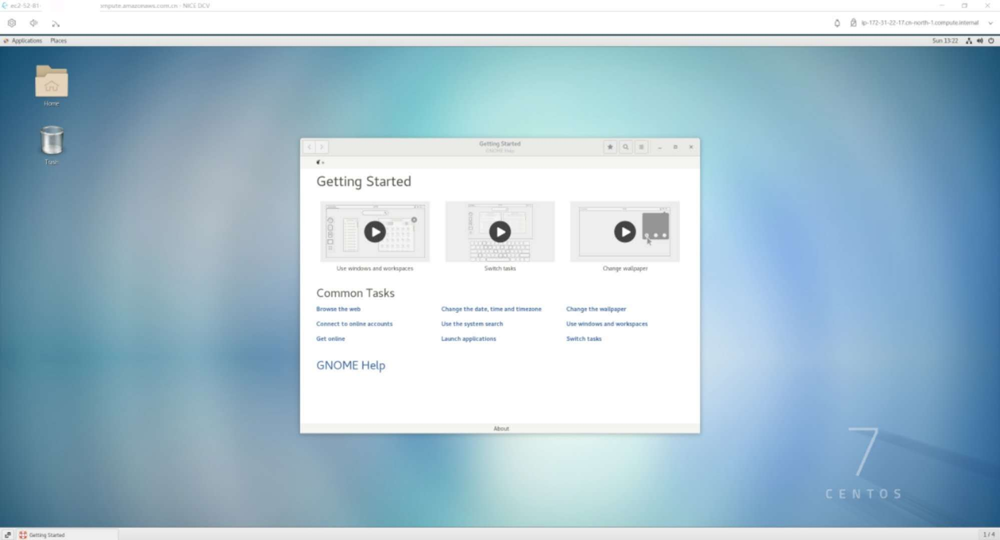

# NICE DCV Remote Desktop Deployment Guide For CentOS 7.x

NICE DCV is a high-performance remote display protocol that provides a secure way to deliver remote desktops and application streaming in both Linux and Windows enviroment created by NICE - an AWS Company.

## Test Enviroment

- EC2 Instance
  - Region：**cn-north-1(Beijing)**
  - Instance Type: **g4dn.xlarge**
  - AMI ID: **ami-088b61f50b18f807e**
  - OS Version: **CentOS Linux release 7.8.2003 (Core)**
  - EBS Volume(Type): **256GB(gp2)**
  - Instance IAM Role: **AmazonS3ReadOnlyAccess(for EC2)**
  - GPU Details
    - Product Name: **NVIDIA Tesla T4**

## Related Resources

- NICE DCV: **https://docs.aws.amazon.com/dcv/index.html**
- Install NVIDIA Driver for EC2 Linux: **https://docs.amazonaws.cn/en_us/AWSEC2/latest/UserGuide/install-nvidia-driver.html**
- NICE DCV Client Download Link: **https://download.nice-dcv.com/**

## Deploy

- Install GNOME env and desktop manager

  ```
  sudo yum groupinstall "GNOME Desktop"
  sudo yum upgrade
  sudo reboot
  ```

- Configure X server

  ```
  sudo systemctl get-default
  sudo systemctl set-default graphical.target
  sudo systemctl isolate graphical.target
  ps aux | grep X | grep -v grep
  ```

  if works well, it should get output like this:

  ```
  root      1891  0.0  0.7 277528 30448 tty7     Ssl+ 10:59   0:00 /usr/bin/Xorg :0 -background none -verbose -auth /run/gdm/auth-for-gdm-wltseN/database -seat seat0 vt7
  ```

- Install the glxinfo Utility

  ```
  sudo yum install glx-utils
  ```

- Install NVIDIA Drivers for Linux

  - ```
    sudo yum install -y gcc
    sudo yum install -y make
    sudo yum update -y
    sudo reboot
    ```
  - After reboot

    ```
    sudo yum install -y gcc kernel-devel-$(uname -r)
    ```

  - Add **nouveau** to the **/etc/modprobe.d/blacklist.conf** blacklist file

    ```
    cat << EOF | sudo tee --append /etc/modprobe.d/blacklist.conf
    blacklist vga16fb
    blacklist nouveau
    blacklist rivafb
    blacklist nvidiafb
    blacklist rivatv
    EOF
    ```

  - Edit the **/etc/default/grub** file and add the following line:

    ```
    GRUB_CMDLINE_LINUX="rdblacklist=nouveau"
    ```

  - Rebuild the Grub Configuration

    ```
    sudo grub2-mkconfig -o /boot/grub2/grub.cfg
    ```

  - Download the GRID driver installation utility

    ```
    aws s3 cp --recursive s3://ec2-linux-nvidia-drivers/g4/latest/ . --region us-east-1 --no-sign-request
    ```

  - Add permission to driver installation utility that you just downloaded

    ```
    sudo chmod +x NVIDIA-Linux-x86_64\*.run
    ```

    | :exclamation: WARNING                                                                                                                                                                  |
    | :------------------------------------------------------------------------------------------------------------------------------------------------------------------------------------- |
    | Warning: If the below installation error shows: You appear to be running an X server; please exit X before installing centos,restart the gdm by **sudo systemctl restart gdm.service** |

  - Run the self-install script as follows to install the GRID driver
    ```
    sudo /bin/sh ./NVIDIA-Linux-x86_64\*.run
    ```
  - ```
    sudo reboot
    ```
  - If nothing gose wrong,the response for the following command lists the installed version of the NVIDIA driver and details about the GPUs
    ```
    nvidia-smi -q | head
    ```

- Verify OpenGL Software Rendering

  - Make sure that the X server is running, and use the following command:
    - ```
      sudo DISPLAY=:0 XAUTHORITY=$(ps aux | grep "X.*\-auth" | grep -v grep | sed -n 's/.*-auth \([^ ]\+\).*/\1/p') glxinfo | grep -i "opengl.*version"
      ```
      The following shows example output if OpenGL software rendering is available:
    - ```
      OpenGL core profile version string: 3.3 (Core Profile) Mesa 17.0.5
      OpenGL core profile shading language version string: 3.30
      OpenGL version string: 3.0 Mesa 17.0.5
      OpenGL shading language version string: 1.30
      OpenGL ES profile version string: OpenGL ES 3.0 Mesa 17.0.5
      OpenGL ES profile shading language version string: OpenGL ES GLSL ES 3.00
      ```

- Install and Configure NVIDIA Drivers

  - ```
      nvidia-xconfig --preserve-busid --enable-all-gpus
    ```

    | :exclamation: WARNING |
    | :-------------------- |


    | Make sure that your server does not have the legacy **/etc/X11/XF86Config** file. If it does, **nvidia-xconfig** updates that configuration file instead of generating the required **/etc/X11/xorg.conf** file. Run the following command to remove the legacy XF86Config file:

    ```
    sudo rm -rf /etc/X11/XF86Config*
    ```

    |

  - Optinal: Check if **/etc/X11** has the right permission,if not,chmod it

    ```
    sudo chmod +x /etc/X11
    ```

  - Restart X server
    ```
    sudo systemctl isolate multi-user.target
    sudo systemctl isolate graphical.target
    ```
  - To verify that OpenGL hardware rendering is available

    - ```
      sudo DISPLAY=:0 XAUTHORITY=$(ps aux | grep "X.*\-auth" | grep -v grep | sed -n 's/.*-auth \([^ ]\+\).*/\1/p') glxinfo | grep -i "opengl.*version"
      ```
    - The following shows example output if OpenGL hardware rendering is available.
      ```
      OpenGL core profile version string: 4.4.0 NVIDIA 390.75
      OpenGL core profile shading language version string: 4.40 NVIDIA via Cg compiler
      OpenGL version string: 4.6.0 NVIDIA 390.75
      OpenGL shading language version string: 4.60 NVIDIA
      OpenGL ES profile version string: OpenGL ES 3.2 NVIDIA 390.75
      OpenGL ES profile shading language version string: OpenGL ES GLSL ES 3.20
      ```

- Install the NICE DCV Server

  - ```
    sudo rpm --import https://d1uj6qtbmh3dt5.cloudfront.net/NICE-GPG-KEY
    wget https://d1uj6qtbmh3dt5.cloudfront.net/2020.0/Servers/nice-dcv-2020.0-8428-el7.tgz
    tar -xvzf nice-dcv-2020.0-8428-el7.tgz
    cd nice-dcv-2020.0-8428-el7
    sudo yum install nice-dcv-server-2020.0.8428-1.el7.x86_64.rpm
    sudo yum install nice-xdcv-2020.0.296-1.el7.x86_64.rpm
    ```

  - ```
    (optional)sudo yum install nice-xdcv-2020.0.296-1.el7.x86_64.rpm
    (optional)sudo yum install nice-dcv-gl-2020.0.759-1.el7.x86_64.rpm
    (optional)sudo yum install nice-dcv-simple-external-authenticator-2020.0.87-1.el7.x86_64.rpm
    ```

- Post-Installation Checks

  - Please make sure that your instance has enabled security group rule for port **8843**
  - Verify **dcv** user can access the X server
    - ```
      sudo DISPLAY=:0 XAUTHORITY=$(ps aux | grep "X.*\-auth" | grep -v grep | sed -n 's/.*-auth \([^ ]\+\).*/\1/p') xhost | grep "SI:localuser:dcv$"
      ```
    - If the command returns **SI:localuser:dcv**, the dcv user can access the X server,if not,restart the X Server
      ```
      sudo systemctl isolate multi-user.target
      sudo systemctl isolate graphical.target
      ```
  - Run **sudo dcvgldiag** for test purpose

  - Start NICE DCV Server on Linux
    - ```
      sudo systemctl start dcvserver
      sudo systemctl enable dcvserver
      ```

- Managing NICE DCV Sessions
  - Setting linux user **ec2-user** password
    ```
    sudo passwd ec2-user**
    ```
  - Example commond for create a **console** session named **sample-session** for user **ec2-user**
    - ```
      sudo dcv create-session --type=console --owner ec2-user sample-session
      ```

## Connect with NICE DCV Client

- Download the NICE DCV Client: **https://download.nice-dcv.com/**
- Enter the EC2 instance host / ip, and linux user, password

  | :exclamation: WARNING                                                                                                        |
  | :--------------------------------------------------------------------------------------------------------------------------- |
  | If connection failed, check if the **firewalld** service in CentOS is enabled, if it does, disable it or allow port **8834** |

## Screenshots


